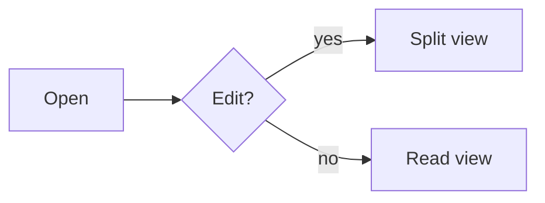
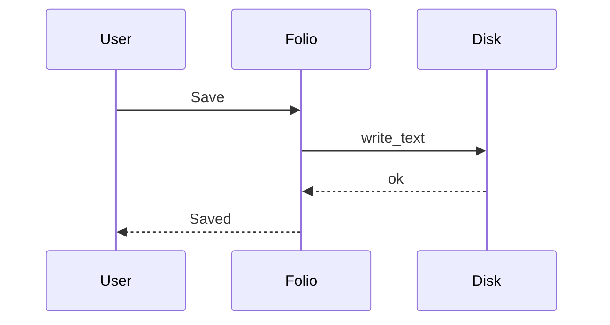

# Folio feature test

A document that exercises everything Folio renders. Open it in each view (Read, Live, Split, Edit) and compare. This paragraph has several sentences. Use it to try focus mode, where only the current sentence stays bright.

## Inline formatting

Folio renders **bold**, _italic_, ***both***, ~~strikethrough~~, `inline code` and [a link to the guide](../README.md). A bare URL becomes a link too: https://github.com.

### Inline HTML

Keys like <kbd>Ctrl</kbd>+<kbd>Shift</kbd>+<kbd>P</kbd>, <b>bold</b>, <i>italic</i>, <u>underlined</u>, <s>struck</s>, <mark>highlighted</mark>, H<sub>2</sub>O, x<sup>2</sup>, <small>small print</small> and <span>a plain span</span>.
A forced line break follows<br>and this is the next line. An <!-- HTML comment --> stays hidden in Read view.

<details><summary>HTML details block</summary>

Hidden content with <kbd>Ctrl</kbd>+<kbd>S</kbd>.

</details>

## Lists

- Bullet one
- Bullet two
  - Nested bullet
    - Deeper
- Bullet three

1. First
2. Second
3. Third

### Task list

- [x] Render Markdown
- [ ] Tick me in the preview or in Live mode
- [ ] Nested
  - [ ] child task
  - [x] done child

## Tables

| Feature        | Left   | Center | Right |
|:---------------|:-------|:------:|------:|
| Tabs           | yes    |   ✅   |     1 |
| Math           | yes    |   ✅   |    22 |
| Mermaid        | yes    |   ✅   |   333 |
| **Formatting** | `code` | _em_   |  4444 |

Put the cursor in the table and press Shift+Alt+F to align its columns:

| a | bb | ccc |
|---|---|---|
| long cell content | x | y |

## Code

```ts
function greet(name: string): string {
  return `Hello, ${name}!`; // comment
}
```

```python
def fib(n):
    a, b = 0, 1
    for _ in range(n):
        a, b = b, a + b
    return a
```

    Indented code block

## Math

Inline $e^{i\pi} + 1 = 0$ and $\sqrt{a^2 + b^2}$. A price like "costs $5 and $6" stays plain text.

$$
\int_0^1 x^2\,dx = \frac{1}{3}
$$

```math
\sum_{n=1}^{\infty} \frac{1}{n^2} = \frac{\pi^2}{6}
```

## Diagrams





## Quotes and footnotes

> Simplicity is prerequisite for reliability.[^1]
>
> > A nested quote.

[^1]: Edsger W. Dijkstra.

---

## Callouts

> [!NOTE]
> Useful information that users should know.

> [!TIP] A custom title
> Helpful advice for doing things better.

> [!IMPORTANT]
> Key information users need to know.

> [!WARNING]
> Urgent info that needs immediate attention.

> [!CAUTION]- Click to open
> A foldable callout, closed until clicked.

## Folding and table editing

Hover a heading (in Read or Live view) and click the arrow at its left to fold its section. In the editor, use the gutter arrows or Ctrl+Shift+[ / ].

Right-click in this table (Live, Split or Edit view) and open **Table** to add, move or delete rows and columns:

| Item  | Qty | Price |
|:------|:---:|------:|
| Apple |  3  |  1.20 |
| Pear  | 10  |  0.80 |

Drag an image file from Explorer / Finder onto this line to insert it.

## Emoji and Unicode

Türkçe karakterler: İstanbul, ığdır, şeker, çiçek, göz, üzüm. Search in Folder matches İ and i either way.

Emoji: ✅ 🚀 📝

## Focus mode practice

Press Ctrl+Shift+Enter to enter focus mode. Click inside this paragraph and move the cursor from sentence to sentence. Each one lights up in turn. The bar at the bottom appears when you move the mouse. Press Esc to leave.

This is a second paragraph for paragraph highlighting. It has two sentences.

## Long section 1

Lorem ipsum dolor sit amet, consectetur adipiscing elit. Sed do eiusmod tempor incididunt ut labore et dolore magna aliqua. Ut enim ad minim veniam, quis nostrud exercitation ullamco laboris.

## Long section 2

Lorem ipsum dolor sit amet, consectetur adipiscing elit. Sed do eiusmod tempor incididunt ut labore et dolore magna aliqua. Duis aute irure dolor in reprehenderit in voluptate velit esse.

## Long section 3

Lorem ipsum dolor sit amet, consectetur adipiscing elit. Sed do eiusmod tempor incididunt ut labore et dolore magna aliqua. Excepteur sint occaecat cupidatat non proident.

## Long section 4

Lorem ipsum dolor sit amet, consectetur adipiscing elit. Sed do eiusmod tempor incididunt ut labore et dolore magna aliqua. Sunt in culpa qui officia deserunt mollit anim id est laborum.

## Long section 5

Lorem ipsum dolor sit amet, consectetur adipiscing elit. Sed do eiusmod tempor incididunt ut labore et dolore magna aliqua. The end of the document, useful for testing scroll sync.
